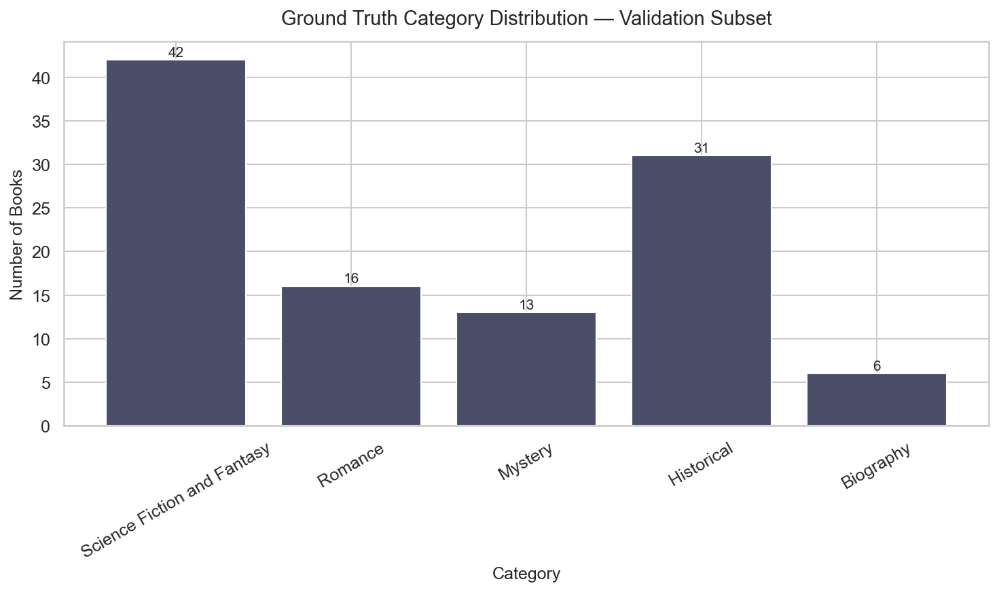
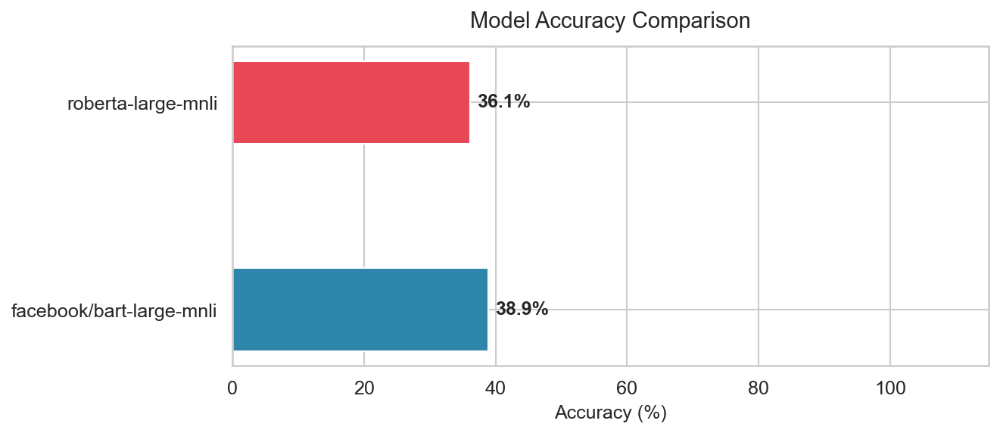
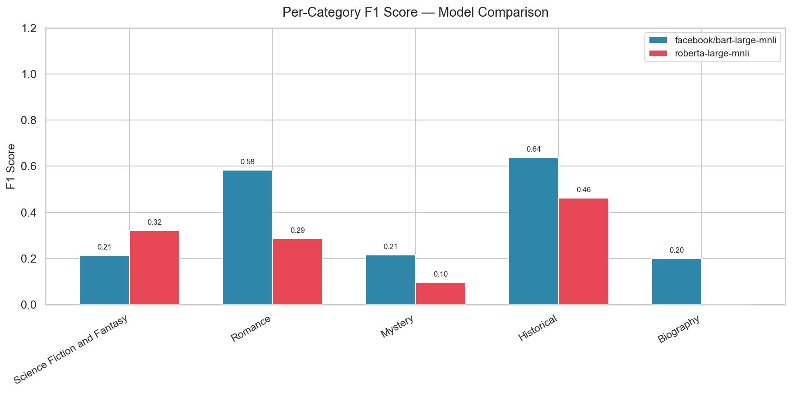
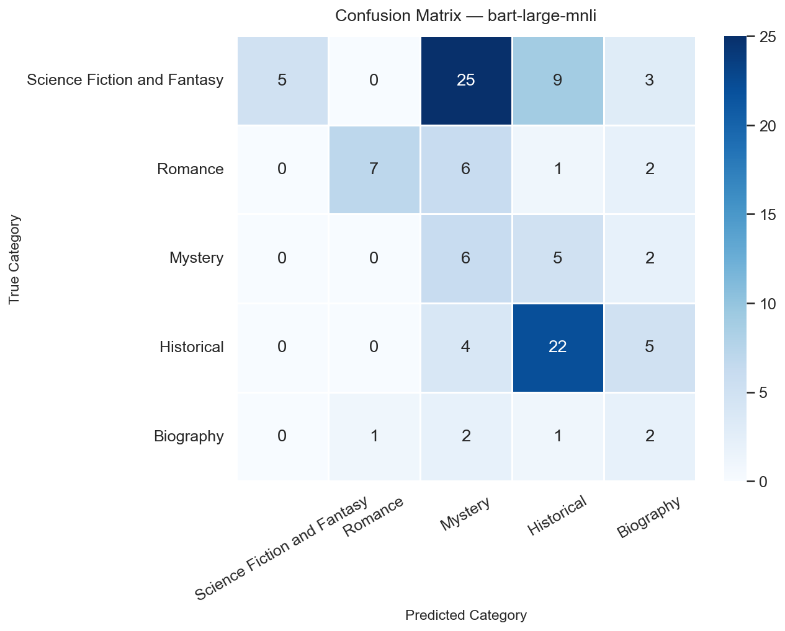
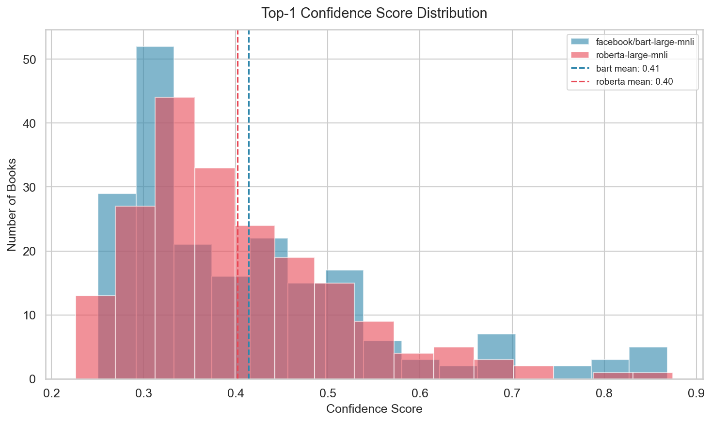
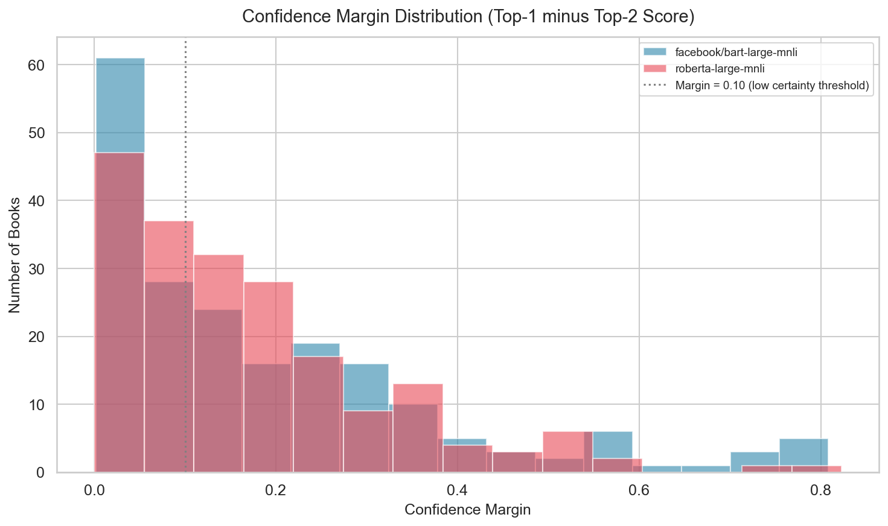
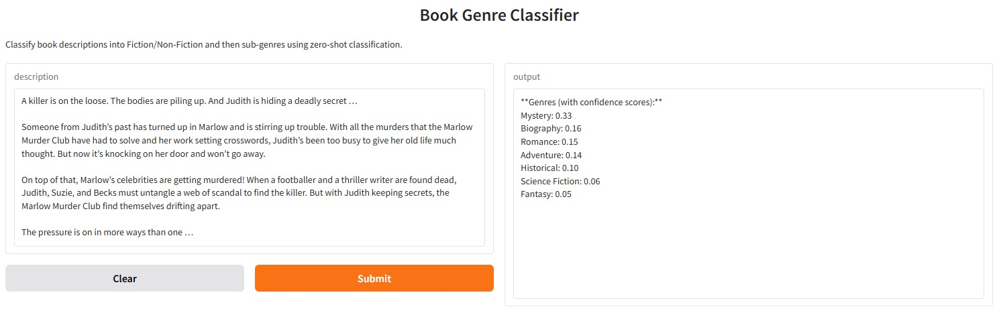
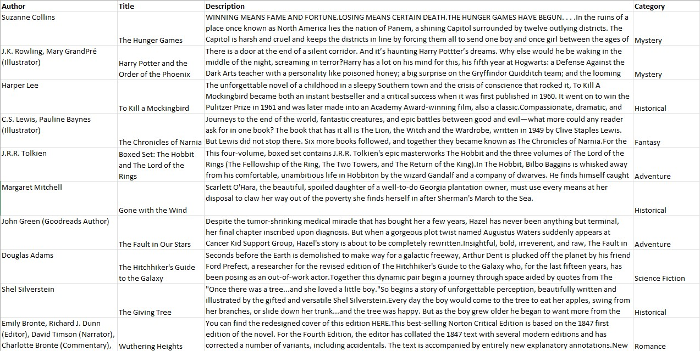

---

layout: default

title: Books genre classification (Zero-Shot Classification)

permalink: /zero-shot-classification/

---

# Project currently undergoing enhancements

## Goals and objectives:

The business objective is to categorise each book in a bookstore's inventory to support physical shelf layout and to improve the customer experience on the bookstore's website. The originally specified categories were: Science Fiction, Romance, Mystery, Adventure, Fantasy, Historical, and Biography. As set out in the Methodology and Results sections below, analysis of the source data's genre tagging led to a justified revision of this scheme — a structural finding about the genre data itself, rather than a simplification of the original business requirement.

The business also wished to understand whether books could be classified as fiction or non-fiction, and whether the intended target audience (children, young adult, or adult) could be identified, from the book description alone. The target audience question was explored qualitatively in earlier development of this project and found unreliable — the description reflects the content of a book rather than its intended readership — but was not revisited as part of the quantified re-evaluation carried out in this revision, which is focused specifically on genre classification rigour. As well as classifying the existing book inventory, the bookstore wanted a simple web application allowing a staff member or customer to submit a book description and receive a generated category in return.

A zero-shot classification approach was selected for this project, using publicly available pretrained transformer models from Hugging Face, requiring no labelled training data and no model fine-tuning. This is one of four projects in the Deep Learning & NLP category of the portfolio, and differs in character from the statistical and tree-based machine learning projects found elsewhere: rather than fitting a model to data, the central skill demonstrated here is evaluating and diagnosing the behaviour of an existing, general-purpose pretrained model against a specific business task — a skill that is increasingly central to applied AI work in industry, where training or fine-tuning a model from scratch is often neither necessary nor practical.

Given the absence of GPU compute, the analysis is deliberately scoped as a Proof of Concept (PoC): a structured methodology is applied and rigorously evaluated on a representative random sample of the book inventory, rather than the full ~50,000-book catalogue, with the explicit expectation that the same pipeline is directly scalable to the full inventory given suitable compute resources.

## Application:  

Zero-shot classification allows a pretrained language model to assign text to categories it has never explicitly been trained to recognise, by leveraging the model's general understanding of language and semantic relationships rather than a fixed, pre-learned set of output classes. This removes the need for the expensive, time-consuming process of manually labelling a training dataset and retraining a model whenever a new category is required, making it particularly valuable for tasks involving new, rare, or rapidly evolving categories.

The zero-shot classification models used in this project work by reframing classification as a Natural Language Inference (NLI) problem. An NLI model is trained to judge whether one piece of text (a "hypothesis") is logically entailed by another (a "premise") — for example, given the premise "A man is playing guitar on stage", the model judges whether the hypothesis "A man is performing music" is entailed, contradicted, or unrelated. Zero-shot classification repurposes this mechanism directly: the text to be classified becomes the premise, and each candidate label is converted into a hypothesis using a template such as "This example is about {label}." The model scores how strongly the premise entails each hypothesis in turn, and the label producing the highest entailment score is selected as the predicted category. Because this process relies only on the model's general language understanding, and not on any label-specific training, a model that has never seen the words "Biography" or "Science Fiction" used as classification targets can still meaningfully judge how well a piece of text supports each as a description of its content.

This approach is applicable across many sectors and scenarios. Practical examples showing where zero-shot classification provides clear business value include:

🏦 **Financial & Compliance**:

**Industry/Sector Classification**: Financial institutions automatically classify a company into its correct industry or sector — for example using Global Industry Classification Standard (GICS) categories — based on its textual description, annual report content, or business activities, without needing a labelled training set covering every possible sector.  

**Regulatory and Support Ticket Triage**: Compliance teams route incoming regulatory filings, customer enquiries, or support tickets into specific processing queues (e.g. "new loan application," "compliance enquiry," "account dispute"), including categories that did not exist when the underlying model was trained.

📦 **Retail & Customer Experience**:

**Customer Feedback Categorisation**: Retailers sort customer feedback and product reviews into emerging categories such as "app performance bug," "delivery service issue," or "sustainable packaging concern," without requiring a pre-labelled dataset for each new category as it arises.  

**Product Catalogue Classification**: E-commerce platforms and physical retailers — including the book genre classification problem addressed in this project — assign catalogue items to category structures directly from product or content descriptions, where new items arrive continuously and a labelled training set can never be fully exhaustive.

🏭 **Operations & Manufacturing**: 

**Maintenance Log Triage**: Industrial maintenance teams automatically categorise unstructured text from maintenance logs or sensor alerts (e.g. "abnormal vibration detected in CNC machine axle") into specific maintenance tasks or severity levels, without first manually labelling a historical archive of logs.  

**Quality and Safety Alert Routing**: Manufacturing quality teams route free-text inspection notes and safety observations to the correct department or escalation tier, where the categories of concern shift over time as new failure modes are identified.

🔒 **Cybersecurity**:  

**Novel Threat Classification**: Cybersecurity platforms classify zero-day malware or previously unseen phishing email patterns by comparing their behavioural attributes or content against a semantic description of known threat families, rather than requiring a labelled example of every new threat variant before it can be detected.  

**Incident Report Triage**: Security operations teams categorise incoming incident reports by likely threat type and severity directly from free-text descriptions, supporting faster initial routing before detailed manual investigation begins.


## Methodology:  

The methodology for this project is implemented as two Python scripts. The first (Zero_Shot_Classification_Books.py) is the main analysis pipeline: it loads and cleans the source data, constructs a ground truth via genre-tag mapping, runs two zero-shot models on a sampled subset of the inventory, evaluates and compares both models against the constructed ground truth, and produces six diagnostic visualisations. The second (Zero_Shot_Classification_Books_Gradio.py) is a companion web application allowing live classification of a single book description. Both scripts use pandas for data handling, Hugging Face Transformers for the zero-shot classification pipeline, and seaborn/matplotlib for visualisation; the web application additionally uses Gradio.

### Data Source:

The dataset used is the "Goodreads Best Books Ever" dataset, available at [Kaggle](https://www.kaggle.com/datasets/arnabchaki/goodreads-best-books-ever), comprising approximately 50,000 book records with titles, authors, descriptions, and user-submitted genre tags ("shelves"). The genre tags are crowd-sourced rather than editorially curated against a fixed taxonomy — a limitation discussed further in the Results section. The raw CSV file also contains a number of malformed rows with unescaped quoting that cause pandas' default C parser to fail outright partway through the file; this is resolved by reading the file with the slower but more tolerant Python parsing engine (engine='python') and discarding any row that remains unparseable (on_bad_lines='skip').

### Data Preparation and Sampling:

Given the absence of GPU compute, this project is deliberately scoped as a Proof of Concept. On a mid-range CPU-only laptop, classifying a single description against the candidate label set takes several seconds per model, scaling with the number of candidate categories; the full pipeline — both models, the full label set, and the supplementary fiction/non-fiction test — runs in under 30 minutes for a sample of 200 books. The pipeline is directly scalable to the full inventory given access to GPU compute.

An important methodological correction was identified during development: an early version of the script read only the first N rows of the source file. Because the Goodreads file is rank-ordered by popularity, this produced a systematically biased sample, skewed heavily toward bestseller genres such as Fantasy and Young Adult fiction, and entirely excluding less universally popular categories such as Biography. This was corrected by reading and cleaning the entire dataset first, then drawing a reproducible random sample (fixed random_state) of the target size from the full cleaned pool, ensuring the sample reflects the catalogue as a whole rather than only its most popular titles.

### Ground Truth Construction — Genre-Tag Mapping:

Because no editorially verified genre label exists for these books, the user-submitted Goodreads genre tags are used to construct a ground truth for quantitative evaluation — a meaningful improvement on a purely qualitative human-validation approach, but one with an important caveat addressed in the Results section. Each book carries multiple free-text genre tags (e.g. ['Fantasy', 'Young Adult', 'Fiction', 'Magic']); these are parsed and mapped to the project's target categories via a curated keyword dictionary. A book is included in the quantitative evaluation only if its tags map to exactly one target category — books whose tags map to zero categories, or to more than one, are excluded as unclassifiable or genuinely ambiguous respectively. This produces a smaller but clean validation subset, and the exclusion rate is itself reported as a measure of the inherent ambiguity in how books are genre-tagged.

### Category Scheme Revision — Resolving Genre Overlap:

Initial application of the mapping above produced an unexpected pattern: Science Fiction was almost entirely absent from the clean validation subset, despite being one of the original seven business categories. Investigation of the source data's genre tags found that 299 of the 320 books tagged "Science Fiction" (93%) are also tagged "Fantasy", and that the great majority of books tagged "Adventure" are likewise also tagged "Fantasy" — substantially less overlap exists between "Adventure" and "Science Fiction" directly. Under the single-category mapping rule, this overlap was routing almost the entire Science Fiction population into the "ambiguous, multiple categories matched" exclusion bucket, regardless of sample size — simply increasing the sample would not have resolved this.

Rather than dropping Fantasy from the category scheme — which would have sacrificed one of the most commercially central genres for an actual bookstore — Science Fiction, Fantasy, and Adventure were merged into a single combined category, "Science Fiction and Fantasy", reducing the scheme from seven categories to five. This reflects a genuine characteristic of how these genres are tagged, and in practice how many physical bookstores shelve them, rather than a simplification made purely for analytical convenience. The merge directly increased the clean validation subset from 76 to 108 books on the same 200-book sample, with no category left unrepresented.

A follow-up experiment tested whether the exact wording of the merged label affected model behaviour, given that zero-shot classification scores depend on the literal text of each candidate label. A more concise label ("Science Fiction and Fantasy") was compared against a three-way phrasing ("Science Fiction, Fantasy and Adventure"); the simpler phrasing produced no meaningful change in classification recall for the category, ruling out label-wording as the primary cause of a separate model behaviour discussed in the Results section.

### Model Comparison:

Two pretrained zero-shot classification models from Hugging Face are run on the same sample for direct comparison: facebook/bart-large-mnli and roberta-large-mnli. Both are run with the identical candidate label set and book descriptions, allowing a like-for-like accuracy comparison.

### Evaluation Metrics:

Predictions from both models are compared against the genre-tag-derived ground truth on the clean validation subset, using overall accuracy, a full per-category classification report (precision, recall, F1-score), and a confusion matrix. It should be stated plainly that the genre tags used as ground truth are themselves user-submitted and have not been independently verified for accuracy; the reported figures therefore represent agreement with crowd-sourced Goodreads genre tagging, rather than an absolute measure of correctness. Disagreement between a model's prediction and the tagged genre may reflect a genuine model error, an inconsistency in how the book was originally tagged, or both — the dataset does not allow these to be distinguished with certainty.

### Confidence Score Analysis:

Beyond the top predicted category, the full set of confidence scores returned by the zero-shot pipeline is retained for every classified book, from which two further metrics are derived: the top-1 confidence score, and the confidence margin — the gap between the top-ranked and second-ranked category. A narrow margin indicates a book the model found genuinely difficult to assign between two competing categories, independent of whether the final prediction happened to be correct.

### Fiction / Non-Fiction — Testing the Original Negative Finding:

The original version of this project excluded fiction/non-fiction classification on the basis of informal human validation, with no supporting figures. This project re-tests that finding quantitatively: a second, separate ground truth is derived from the same genre tags, mapping a defined set of fiction- and non-fiction-associated tags, and the better-performing model from the main comparison is applied to a binary Fiction / Non-Fiction candidate label set on the subset of books with an unambiguous fiction/non-fiction tag. This converts the original qualitative claim into a quantified, reportable result.

### Web Application (Gradio):

A companion Gradio web application allows a user to submit a book description directly and receive a live classification, using the same five-category scheme established above. The application surfaces the full confidence breakdown across all five categories using Gradio's Label component, and — informed directly by the confidence and error analysis in the main pipeline — automatically flags low-confidence or low-margin predictions as candidates for human review, reflecting how a classifier of this kind would realistically be deployed in a production workflow rather than treated as a fully automated final decision.

## Results:

### Validation Subset:

Of the 200-book random sample, 108 books (54%) mapped to exactly one of the five target categories and form the clean validation subset used for the accuracy and classification report figures below; the remaining 92 books were excluded as either unclassifiable or genuinely ambiguous. The ground truth distribution across the validation subset is shown below.



Science Fiction and Fantasy is the largest category in the validation subset (42 books), followed by Historical (31), Romance (16), Mystery (13), and Biography (6).

### Model Accuracy Comparison:

facebook/bart-large-mnli achieves an overall accuracy of 38.89% on the validation subset; roberta-large-mnli achieves 36.11%.



This is a modest 2.78 percentage point difference on a validation set of 108 books, and is consistent with a pattern observed throughout development of this project: across several different validation samples and label-scheme revisions tested, the relative ranking between the two models reversed each time, with the gap never exceeding around 6 percentage points. Given a validation set of this size, this level of fluctuation is well within ordinary sampling variation. The more defensible conclusion is that the two models perform comparably on this task, rather than one being reliably superior.

### Per-Category Performance:

The classification reports below break down precision, recall, and F1-score by category for both models.

**facebook/bart-large-mnli:**
```
                              precision    recall  f1-score   support
 Science Fiction and Fantasy       1.00      0.12      0.21        42
                     Romance       0.88      0.44      0.58        16
                     Mystery       0.14      0.46      0.21        13
                  Historical       0.58      0.71      0.64        31
                   Biography       0.14      0.33      0.20         6
```

**roberta-large-mnli:**
```
                              precision    recall  f1-score   support
 Science Fiction and Fantasy       1.00      0.19      0.32        42
                     Romance       0.60      0.19      0.29        16
                     Mystery       0.12      0.08      0.10        13
                  Historical       0.31      0.87      0.46        31
                   Biography       0.00      0.00      0.00         6
```


The two models show distinct, contrasting error patterns rather than a uniform difference in quality. facebook/bart-large-mnli is highly conservative for Science Fiction and Fantasy — perfect precision (1.00) but very low recall (0.12) — meaning it is correct whenever it predicts this category, but predicts it for only a small fraction of the books that genuinely belong to it. roberta-large-mnli, in contrast, shows a strong directional bias toward over-predicting Historical (precision 0.31, recall 0.87): it captures most genuinely Historical books correctly, but at the cost of misclassifying a large number of other books into that category too, and fails to identify a single Biography book correctly.

## A Specific Confusion: Mystery and Science Fiction/Fantasy:

The confusion matrix below shows the full breakdown of `bart-large-mnli`'s predictions against the validation ground truth.



A clear pattern is visible: a large share of bart's "Mystery" predictions, and a large share of the missed Science Fiction and Fantasy books, are one and the same. Of the 42 true Science Fiction and Fantasy books, only around 5 are correctly identified (recall 0.12); the remaining 37 are predicted as something else. Of bart's roughly 43 total Mystery predictions, only around 6 are genuinely Mystery books (precision 0.14) — the remaining 37 are false positives. These two figures match closely, indicating that the great majority of misclassified Science Fiction and Fantasy books are specifically being routed into the Mystery category, rather than spread evenly across the other categories.

This is a genuine, reportable limitation of zero-shot classification rather than an artefact of this particular dataset. The model has received no domain-specific fine-tuning on book genres, and is instead matching the general semantic and narrative tone of the description text against the candidate label. Many Fantasy and Science Fiction book descriptions are written using thriller-style narrative hooks — danger, hidden secrets, a sense of impending threat — rather than explicit genre markers such as magic systems or futuristic technology, particularly in short blurbs. A model with no genre-specific training is liable to read that surface tone as evidence for Mystery, even where the underlying content is unambiguously Fantasy or Science Fiction. The label-wording experiment described in the Methodology section ruled out the phrasing of the candidate label itself as the cause, reinforcing that this is a genuine content-level confusion rather than a fixable wording issue.

### Confidence Score Analysis:

Across all 200 classified books, the mean top-1 confidence score is 0.41 for bart and 0.40 for roberta, and the confidence margin between the top two categories falls below 0.10 for 42.0% and 39.5% of classifications respectively.




A confidence margin below 0.10 for over 40% of classifications indicates that, for a substantial share of the inventory, the model finds two categories close to equally plausible. This has a direct practical implication for deployment, discussed further in the Conclusions and Next Steps sections: low-margin classifications are natural candidates for a human-in-the-loop review step, rather than being accepted automatically.

### Fiction / Non-Fiction:

Re-testing the original fiction/non-fiction negative finding quantitatively, the better-performing model achieves 43.43% accuracy against the genre-tag-derived fiction/non-fiction ground truth — below the 50% random baseline for a balanced binary task, though the test set itself is heavily imbalanced (161 Fiction books to 14 Non-Fiction). The per-class breakdown shows near-perfect precision but low recall for Fiction (1.00 precision, 0.39 recall), and the inverse for Non-Fiction (0.12 precision, 1.00 recall) — the model substantially over-predicts Non-Fiction relative to its true prevalence in the data. This confirms, with quantified evidence, the original project's qualitative finding that the model cannot reliably distinguish fiction from non-fiction from description text alone.

### A Note on Ground Truth Reliability:

The genre tags used throughout this Results section originate from Goodreads' user-submitted shelving system, not an independently verified taxonomy. Some of the disagreement reported above between model predictions and "ground truth" may reflect genuine model error, and some may reflect inconsistency in how books were tagged by Goodreads users in the first place; the dataset does not allow these two sources of disagreement to be separated with certainty. The accuracy figures reported here should be read as a measure of agreement with crowd-sourced genre tagging, not as an absolute measure of classification correctness.

### 'Book Genre Classifier' web application

The 'Book Genre Classifier' web application was deployed in a temporary online environment and produces a live classification, full confidence breakdown, and human-review flag for any submitted book description. The screenshot below shows the output for one example description.




### Results_old

A sample of the results of the inventory classification is below, which provided a category for each of the 50 thousand books in the inventory.  The accuracy was to a sufficiently high level noting that the definition of 'correct' is subjective.  Two separate models from Hugging Face were used for classifications with the results compared to determine the most accurate method.  The models used were 'facebook/bart-large-mnli' and 'roberta-large-mnli', where the results showed that the 'facebook/bart-large-mnli' was the more accurate of the two.



The 'Book Genre Classifier' app was deployed in a temporary environment on-line and produced accurate and timely results for any textual description provided.  The screenshot below shows the output of one example book description.  


In summary, the classification model met the business requirements for classifying the inventory of books, and the 'Book Genre Classifier' app similarly met the requirements, both in terms of quality of output and time to generate results.

## Conclusions:

The primary conclusion is that it is possible to create a model to classify books in an accurate and timely manner, which can be applied to multiple records of book descriptions, which addresses the initial business objective.  

The overall conclusions are:
* A zero-shot classification model can categorise text without labelled data.  
* A zero-shot classification model can be quickly deployed, with low upfront costs and time.  
  * Utilising python and associated libraries using freely available resources.  
* It highlights the power of using Deep Learning models to solve business problems and provide tangible benefits, and the accessibility of such models.
* Tangible operational efficiencies and savings can be made, freeing up staff for higher-value tasks
* The outputs may not be 100% accurate but the designs are open to additional development and configuration to improve results.

## Next steps:  

While the output of the model met the business requirements, there are recommendations for extending the model to increase accuracy, and extend the information that is provided by the model.

Recommendations include:
* Undertake data cleansing and pre-processing of the book descriptions prior to being applied to the classification model
* Identify additional descriptions for each book from other sources, potentially utilising the unique ISBN code for each book to map to other descriptions of each book
* Implement RAG (Retrieval-Augmented Generation) to augment the descriptions with additional data, to allow better handling of vague or ambiguous descriptions.
* Implement Fine-Tuning on the model using labelled datasets where descriptions are mapped to classifications.
* Multi-category results, e.g. using the top 2 categories
* Hierarchical categories, for example sub-categories of 'Adventure'
* Applying other classifications such as themes of the book
* Experiment with other zero-shot classification models and determine if better results can be generated

## Python code:
You can view the full Python script used for the analysis here: 
[View the Python Script](/Zero_Shot_Classification_Books_v3.py)  
[View the Python Script for Gradio application](/Zero_Shot_Classification_Books_Gradio_v2.py)

